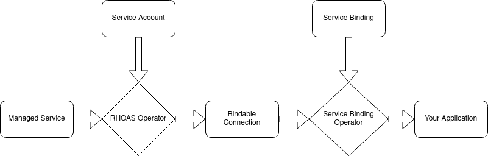

== Service Binding

When you're developing an application that uses multiple services, you normally have to manually configure connections to these services in a configuration file. These connection configurations often include public data such as well-known URLs, as well as private data such as passwords and account IDs.   

Custom resources (CRs) managed by the RHOAS Operator provide service binding annotations. This allows the https://redhat-developer.github.io/service-binding-operator/userguide/intro.html[Service Binding Operator (SBO)] to expose connection information to your application. Because the SBO manages the connection information, the information stays securely inside your OpenShift cluster instead of being shared across different configuration files in source control.

The RHOAS Operator works with the SBO by setting values in the status subresource of `Connection` objects. These values match the values in the binding annotations. This method allows the Service Binding Operator to inject values from the CRs for these objects into end-user workloads.

To learn more about service binding, see https://redhat-developer.github.io/service-binding-operator/userguide/intro.html[Service Binding Operator documentation] and the https://github.com/servicebinding/spec[Service Binding Specification for Kubernetes].
